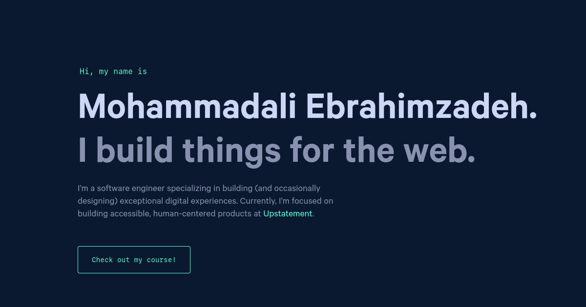

# My Portfolio

My personal website web app that make with gatsby and graphql

Check out the live demo: https://iammohammadali.ir/

## How to run the project?

1. Clone this repository in your local system.
2. Open the command prompt from your project directory and run the command `npm install`.
3. Open the command prompt from your project directory and run the command `npm start`.
4. Hurray! That's it.
